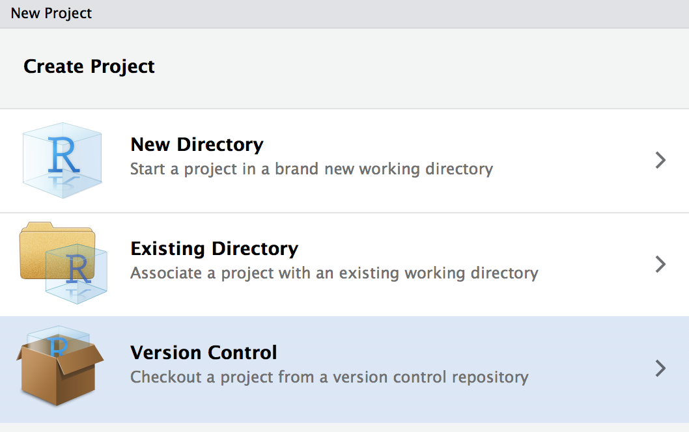
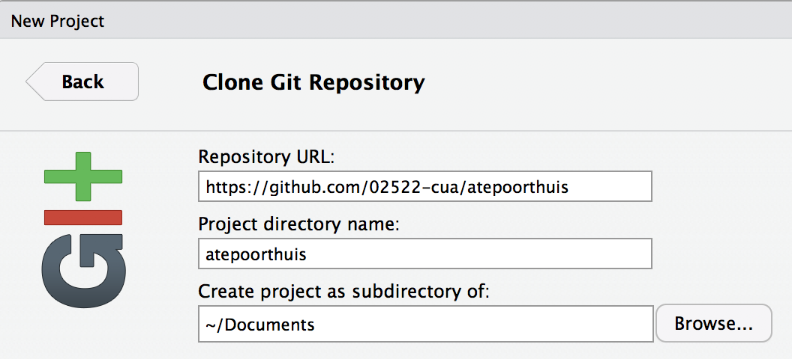
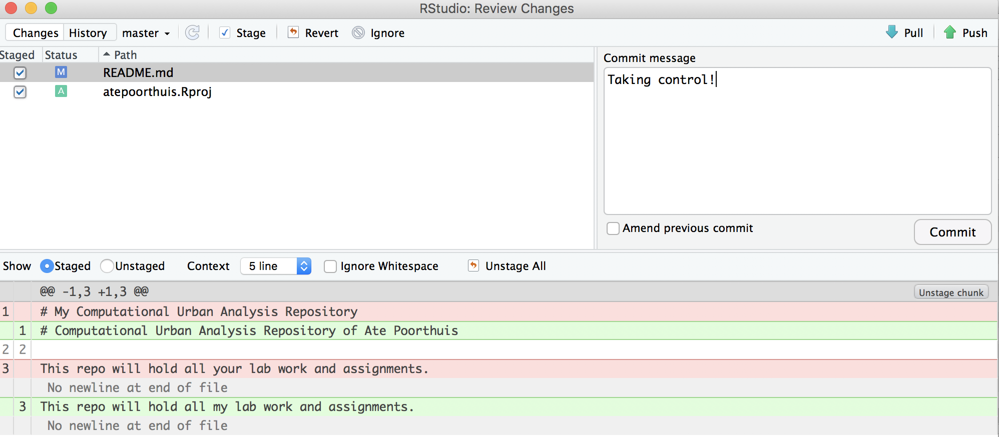
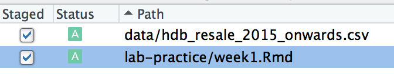

# Week 1

```{r setup, include=FALSE}
knitr::opts_chunk$set(echo = TRUE, message = F)
local({r <- getOption("repos")
       r["CRAN"] <- "https://cloud.r-project.org" 
       options(repos=r)
})
if (!require("pacman")) install.packages("pacman")
pacman::p_load('tidyverse', 'here')
```

## Taking control of your repository

Our key task for this first week is to make ourselves comfortable with using git as a version control system for projects that involve data analysis. Git is a very powerful system -- and many folks even use it to manage other types of projects (e.g. writing). To keep things simple, we'll focus specifically on how git relates to our workflow with R/Rstudio for now.

We will start by taking possesion of the repository you will use to do your work in the context of this course. It has been set up for you already on github.com and should follow the structure `02522-cua/yourname`. For example, my repository would reside at https://github.com/02522-cua/atepoorthuis. Find your repository (here's [a list](https://github.com/02522-cua) of all repos in our course organization) and take note (i.e. copy it to the clipboard) of its url.

Start a new project in RStudio and choose to start one from version control.

Choose to start a project from Git and paste your github repository url in. Do make sure you store the repository somewhere sensible within your general folder organization so you can find it again.


Once you click OK, RStudio will create a new directory and will download (this is called 'cloning' in git parlance) the contents of your repository into it.

## Making your first commit
Now that your repository has found a place on your computer, let's practice changing some things around and see how these changes will be reflected online. There are a few specific steps involved that you need to understand (also check out [this decent visual summary](http://rogerdudler.github.io/git-guide/)):

1. You make some actual changes. You can modify existing files and save those changes or create entirely new files.
2. After making changes, git does not actually now about them yet. We tell git about any changes by `add`ing or `staging` changed files. This sounds tedious but it is actually very handy when you're experimenting and don't necessarily want your half-baked experiment to be sent to the online repository.
3. Once you are happy with your changes, you can make a `commit` of all the staged changes up until that moment. I like to think of this is a milestone. You say: '*these are my changes, please check them in*'. This is also reflected by the fact that every `commit` is accompanied by a commit message that summarizes those changes. We generally keep these messages short so they're easier to read later.
4. After commiting, the changes only still exist on our local computer. We can finally `push` our changes up to Github.com.

Time for practice. Open the README.md file in the 'root' of your project. The current description is a bit generic so let's personalize. I changed mine to:

```
# Computational Urban Analysis Repository of Ate Poorthuis

This repo will hold all my lab work and assignments.
```

Save your change and go to the `Git` pane (usually in the right-hand side of your RStudio window). You should see your README.md file show up there now. If it does, click the `Diff` or `Commit` button. This will open up another window, in which we can do all of our next steps.

- First we need to `stage` our changes. Hit the tick-box in front of README.md. (If the `.proj` file shows up, we can stage that too)
- Next we need to `commit` our staged changes. Write a short commit message describing your change and hit the Commit button.



Now we have commited our changes _locally_ but this is not yet reflected on github.com. We can `push` the state of our repository up to github.com. You will notice a message on the top-left of the git window indicating 'Your branch is 1 commit ahead of origin/master'. `Origin` is git parlance for the online version of our repository. To bring `origin` back into sync with our local version, just press 'Push' and go to your repository on github.com to see the changes. Congratulations you are now a budding git ninja!

## Setting up our HDB data
Now that you have properly taken control of your repository, it is time to start setting up our data for subsequent analysis. The task at hand is to analyze HDB resale prices -- we will start next week with univariate statistics (i.e. analyzing single variables in isolation), after which we will move to multivariate statistics (i.e. looking at the relation between multiple variables). For now, we are just going to set up shop: read and clean our dataset using a series of `tidyverse` operations.

Create a new R Notebook and save it with an appropriate name in your `lab-practice` folder. Use the R Notebook to follow along and experiment with the dataset. Do not just copy the instructions below but type them by hand instead. Also note that it is your responsibility to make sure any of the libraries used below (as recognized from them being loaded with `library`) are actually installed (with `install.packages`).

You can find a data of resale transactions going back to 1990 on the [data.gov.sg](https://data.gov.sg/dataset/resale-flat-prices) website. For now, we will just consider the data from 2015-now so you can download this data set directly from https://www.dropbox.com/s/xorwcqe4h7d1u7q/resale-flat-prices-based-on-registration-date-from-jan-2015-onwards.csv?dl=1. 

As we will use this data across several blocks, you should create a `data/` folder at the root of your project to hold this data.

```{r include=FALSE}
library(tidyverse)
library(httr)
library(here)

# download data and store in right location
url <- "https://www.dropbox.com/s/xorwcqe4h7d1u7q/resale-flat-prices-based-on-registration-date-from-jan-2015-onwards.csv?dl=1"
GET(url, write_disk(here::here("data/hdb_resale_2015_onwards.csv"), overwrite = T))
```

A short note on the `here` package. Rmarkdown documents are always executed in the context of your their current directory. Move a document all of the sudden it might not be able to find the files it's using anymore! This is why we use `here`: it will always point to the root of our project folder. 

Once the data is saved, let's read it in.

```{r}
sales <- read_csv(here::here("data/hdb_resale_2015_onwards.csv"))
```

Use `glimpse()` and `View()` to inspect the resulting tibble. As you'll see the data is relatively clean.

```{r}
sales %>% glimpse()
```

There are just a few adjustments we need to make.

- `month` should probably be converted to a date
- `flat_type`, `storey_range` and `flat_model` are currently `chr` columns but can better be represented as `factor` variables as they are categorical variables.

```{r}
library(lubridate)
library(forcats)

sales %>% 
  mutate(month = ymd(month, truncated = 1),
         flat_type = as_factor(flat_type),
         storey_range = as_factor(storey_range),
         flat_model = as_factor(flat_model))
```

Now it is time to get our cheatsheets out. Last term we gained experience with a suite of `tidyverse` staples to manipulate tables in different ways. The most important of these are probably `filter`, `arrange`, `group_by`, and `summarize`.

Try to put these to practice to answer the following questions:

- What is the earlier lease commencement date and where are these flats located?
- What are the largest HDB flats in Singapore? How much did they sell for?
- What is the most expensive flat in Punggol?
- Which town has, on average, the largest flats (by floor area)?
- Which town has, on average, the cheapest flats per square meter?

Answer each of these questions in a separate code chunk. When you are finished, save your RMarkdown document. You're now ready to make your first 'real' commit.



Walk through these steps -- `stage` your changes, `commit` the staged changes (with an appropriate commit message), and finally `push` your local commits up to the repository on github.com.